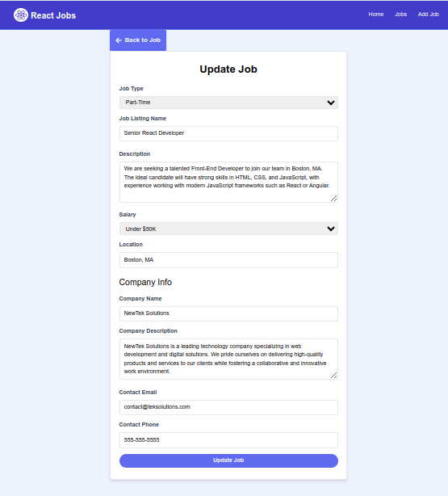

# Job Listing App
## Full CRUD SPA 
#### React.js 18 and Tailwind CSS
#### Showing job list, handle adding, deleting and updating jobs from the form.

</br>

## Purpose
- Practice of the React Framework

## Technologies
- [React Router 6.22.3](https://www.npmjs.com/package/react-router-dom/v/6.22.3?activeTab=versions)
- [React-icons 5.0.1](https://www.npmjs.com/package/react-icons/v/5.0.1)
- [React-spinners 0.13.8](https://www.npmjs.com/package/react-spinners)
- [React-toastify 10.0.5](https://www.npmjs.com/package/react-toastify)
- [JSON-Server 1.0.0-alpha.23](https://www.npmjs.com/package/json-server)
- [Postcss 8.4.38](https://postcss.org/)
- [Tailwindcss 3.4.1](https://tailwindcss.com/)
- [Vite 5.2.0](https://vite.dev/)


## Description & Functionality
- File structure by Vite
- Using Link element of React Router
- Using PropTypes for validation
- Using React Icons for Icons(Font Awesome 5)
- Using JSON Object for the data, loaded from the JSON file by JSON server
- UseNavigate Hook for go back button
- Using Spinner for loading data from API
- Background 404 image by [Vecteezy](vecteezy.com)

## Usage
1. Run JSON Server
```js
npm run server
```
2. Run App
```js
npm run dev
```

3. Preview App for Production
```js
npm run preview
```

4. Build App
```js
npm run build
```

<!-- <ol>
    <li>npm run dev</li>
    <li>npm run server</li>
</ol> -->

<br>


## Description & Functionality
- File structure by Vite
- Typography(imported, woff2 format) : Lato-bold
- Uses prefered color scheme for dark and light mode defined by user system
- Using PropTypes for validation
- Using [React Icons library 5.3.0](https://react-icons.github.io/react-icons/) for icons
- Using form with input and button
- Using [UUID package 11.0.2](https://www.npmjs.com/package/uuid) to generate unique IDs
- Using Tooltips on Icons
- Using LOCAL STORAGE persistence

## Online Link
[Netlify](https://react-job-web.netlify.app/)

## Screenshots





## Author
[With the use of Traversy Media tutorial](https://github.com/bradtraversy/react-crash-2024)
[TiborKopca](https://github.com/TiborKopca) @ 2024